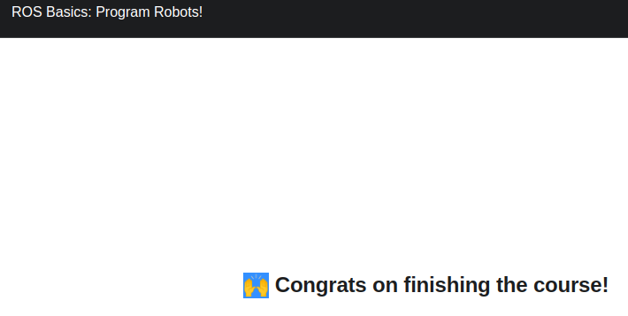

# ROSintro
## Introduction to ROS
<ul>
  <li>
	<strong>1. NODES </strong> 
  </li>
  <li>
	<strong>2. ROS MASTER </strong> 
  </li>
  <li>
	<strong>3. ROS MASTER </strong> 
  </li>
  <li>
	<strong>4. ROS MASTER </strong> 
  </li>
  <li>
	<strong>5. ROS MASTER </strong> 
  </li>
  <li>
	<strong>6. ROS MASTER </strong> 
  </li>
  <li>
	<strong>7. ROS MASTER </strong> 
  </li>
</ul>

  
   
  
  

